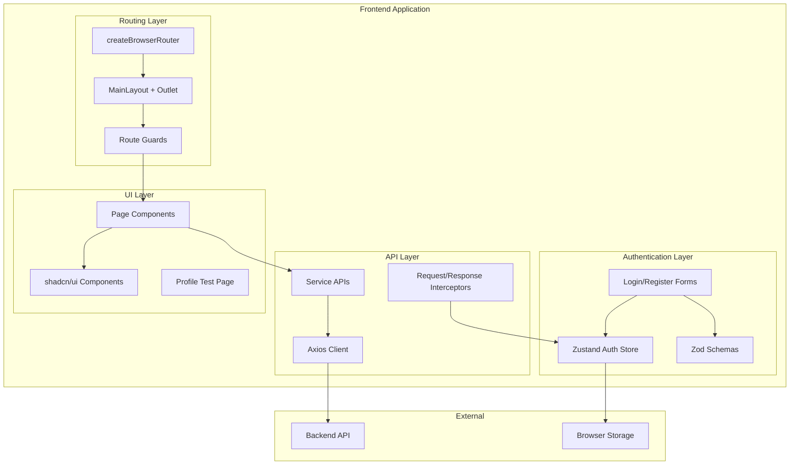
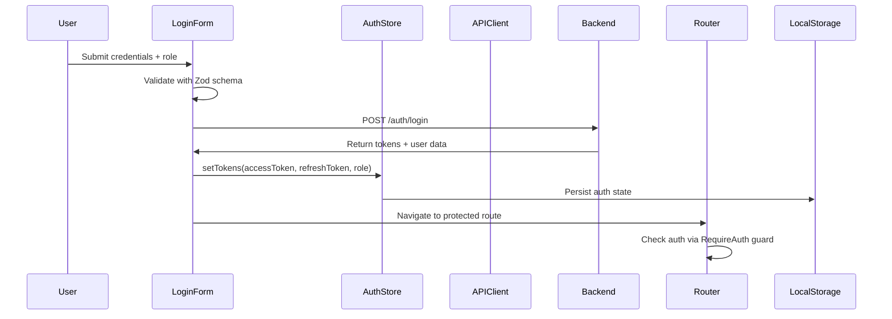
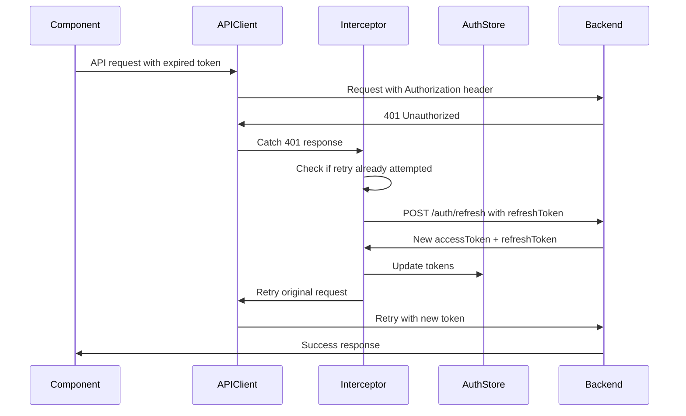

# Design Document: Auth & API Foundation

## Overview

The Auth & API Foundation provides a comprehensive authentication and API communication infrastructure for the ShopBike frontend application. This design establishes secure user authentication with role-based access control, modern routing architecture using React Router v6's createBrowserRouter, and a robust API layer with automatic token management and refresh capabilities.

The foundation supports four user roles (BUYER, SELLER, INSPECTOR, ADMIN) with appropriate registration restrictions, implements schema-first form validation using React Hook Form and Zod, and provides a complete service layer abstraction for API communication. All UI components leverage shadcn/ui for consistency and accessibility.

## Architecture

### High-Level Architecture



### Authentication Flow



### Token Refresh Flow



## Components and Interfaces

### Authentication Store Interface

```typescript
interface AuthState {
  accessToken: string | null;
  refreshToken: string | null;
  role: Role | null;
  setTokens: (payload: {
    accessToken: string;
    refreshToken?: string;
    role: Role;
  }) => void;
  clearTokens: () => void;
}

type Role = "BUYER" | "SELLER" | "INSPECTOR" | "ADMIN";
```

### Router Configuration

The router uses createBrowserRouter with nested route structure. Authentication pages (/login, /register) are rendered outside MainLayout to provide full-screen auth experiences without navigation headers:

```typescript
const router = createBrowserRouter([
  {
    path: "/",
    element: <MainLayout />,
    children: [
      { index: true, element: <HomePage /> },
      { path: "bikes/:id", element: <ProductDetailPage /> },
      {
        path: "profile",
        element: <RequireAuth />,
        children: [{ index: true, element: <ProfileTestPage /> }]
      },
      {
        path: "buyer",
        element: <RequireRole allowedRoles={["BUYER"]} />,
        children: [
          { path: "checkout/:id", element: <CheckoutPage /> },
          { path: "transaction/:id", element: <TransactionPage /> }
        ]
      },
      {
        path: "seller",
        element: <RequireRole allowedRoles={["SELLER"]} />,
        children: [
          { index: true, element: <SellerDashboardPage /> },
          { path: "listings/new", element: <SellerListingEditorPage /> }
        ]
      }
    ]
  },
  // Full-screen auth pages outside MainLayout
  {
    path: "/login",
    element: <GuestGuard><LoginPage /></GuestGuard>
  },
  {
    path: "/register", 
    element: <GuestGuard><RegisterPage /></GuestGuard>
  }
]);
```

### Route Guards

**RequireAuth Guard:**
- Checks for valid accessToken in AuthStore
- Redirects to /login with location state if unauthenticated
- Preserves intended destination for post-login redirect

**GuestGuard:**
- Prevents authenticated users from accessing login/register
- Redirects to preserved location or home page
- Checks accessToken existence in AuthStore

**RequireRole Guard:**
- Extends RequireAuth with role-based authorization
- Accepts allowedRoles array parameter
- Redirects to appropriate page if role doesn't match

### API Client Architecture

**Centralized Logout Strategy:**
```typescript
// Centralized logout handler
const handleLogout = () => {
  useAuthStore.getState().clearTokens();
  
  // Try React Router navigation first
  try {
    const navigate = useNavigate();
    navigate('/login', { replace: true });
  } catch {
    // Fallback for contexts where useNavigate is unavailable
    window.location.href = '/login';
  }
};
```

**Core API Client with Refresh Concurrency Control:**
```typescript
// Refresh concurrency control
let isRefreshing = false;
let refreshPromise: Promise<any> | null = null;
const subscriberQueue: Array<(token: string) => void> = [];

const apiClient = axios.create({
  baseURL: process.env.VITE_API_BASE_URL,
  timeout: 15000,
  headers: { "Content-Type": "application/json" }
});

// Request interceptor for token attachment
apiClient.interceptors.request.use((config) => {
  const token = useAuthStore.getState().accessToken;
  if (token) {
    config.headers.Authorization = `Bearer ${token}`;
  }
  return config;
});

// Response interceptor with concurrency-safe token refresh
apiClient.interceptors.response.use(
  (response) => response.data, // Normalize responses
  async (error) => {
    const originalRequest = error.config;
    
    if (error.response?.status === 401 && !originalRequest._retry) {
      originalRequest._retry = true;
      
      if (!isRefreshing) {
        isRefreshing = true;
        const refreshToken = useAuthStore.getState().refreshToken;
        
        if (!refreshToken) {
          handleLogout();
          return Promise.reject(error);
        }
        
        refreshPromise = refreshTokenRequest(refreshToken)
          .then((response) => {
            useAuthStore.getState().setTokens({
              accessToken: response.accessToken,
              refreshToken: response.refreshToken,
              role: response.role
            });
            
            // Process queued requests with new token
            subscriberQueue.forEach(callback => callback(response.accessToken));
            subscriberQueue.length = 0;
            
            return response.accessToken;
          })
          .catch((refreshError) => {
            handleLogout();
            throw refreshError;
          })
          .finally(() => {
            isRefreshing = false;
            refreshPromise = null;
          });
      }
      
      // Wait for refresh to complete
      try {
        const newToken = await refreshPromise;
        originalRequest.headers.Authorization = `Bearer ${newToken}`;
        return apiClient(originalRequest);
      } catch (refreshError) {
        return Promise.reject(refreshError);
      }
    }
    
    return Promise.reject(error);
  }
);
```

**Refresh Token Client:**
```typescript
// Separate axios instance for refresh to avoid interceptor loops
const refreshClient = axios.create({
  baseURL: process.env.VITE_API_BASE_URL,
  timeout: 10000
});

const refreshTokenRequest = async (refreshToken: string) => {
  const response = await refreshClient.post('/api/auth/refresh', {
    refreshToken
  });
  return response.data;
};
```

### Service Layer

**Authentication Service:**
```typescript
interface LoginRequest {
  emailOrUsername: string;
  password: string;
  role: Role;
}

interface RegisterRequest {
  email: string;
  username: string;
  password: string;
  role: "BUYER" | "SELLER"; // Restricted roles
  firstName: string;
  lastName: string;
}

interface AuthResponse {
  accessToken: string;
  refreshToken: string;
  user: {
    id: string;
    email: string;
    username: string;
    role: Role;
    firstName: string;
    lastName: string;
  };
}

// Note: API endpoints follow backend Swagger specification with /api prefix
export const authApi = {
  login: (data: LoginRequest): Promise<AuthResponse> => 
    apiClient.post('/api/auth/login', data),
    
  register: (data: RegisterRequest): Promise<AuthResponse> => 
    apiClient.post('/api/auth/register', data),
    
  logout: (): Promise<void> => 
    apiClient.post('/api/auth/logout'),
    
  getCurrentUser: (): Promise<AuthResponse['user']> => 
    apiClient.get('/api/auth/me'),
    
  refreshToken: (refreshToken: string): Promise<AuthResponse> => 
    refreshClient.post('/api/auth/refresh', { refreshToken })
};
```

**User Service:**
```typescript
interface UserProfile {
  id: string;
  email: string;
  username: string;
  role: Role;
  firstName: string;
  lastName: string;
  createdAt: string;
  updatedAt: string;
}

// Note: API endpoints follow backend Swagger specification with /api prefix
export const userApi = {
  getProfile: (): Promise<UserProfile> => 
    apiClient.get('/api/users/profile'),
    
  updateProfile: (data: Partial<UserProfile>): Promise<UserProfile> => 
    apiClient.put('/api/users/profile', data)
};
```

## Data Models

### Authentication Models

```typescript
// Core auth types
export type Role = "BUYER" | "SELLER" | "INSPECTOR" | "ADMIN";

export interface User {
  id: string;
  email: string;
  username: string;
  role: Role;
  firstName: string;
  lastName: string;
  createdAt: string;
  updatedAt: string;
}

export interface AuthTokens {
  accessToken: string;
  refreshToken: string;
}

export interface AuthState extends AuthTokens {
  role: Role | null;
  user: User | null;
}

// Form data types
export interface LoginFormData {
  emailOrUsername: string;
  password: string;
  role: Role;
}

export interface RegisterFormData {
  email: string;
  username: string;
  password: string;
  confirmPassword: string;
  role: "BUYER" | "SELLER";
  firstName: string;
  lastName: string;
  acceptTerms: boolean;
}
```

### Form Validation Schemas

Located in `src/utils/rules.ts`:

```typescript
import { z } from "zod";

// Login form schema
export const loginSchema = z.object({
  emailOrUsername: z
    .string()
    .min(1, "Email or username is required")
    .max(100, "Email or username too long"),
  password: z
    .string()
    .min(6, "Password must be at least 6 characters")
    .max(100, "Password too long"),
  role: z.enum(["BUYER", "SELLER", "INSPECTOR", "ADMIN"], {
    required_error: "Please select a role"
  })
});

// Register form schema
export const registerSchema = z.object({
  email: z
    .string()
    .min(1, "Email is required")
    .email("Invalid email format")
    .max(100, "Email too long"),
  username: z
    .string()
    .min(3, "Username must be at least 3 characters")
    .max(30, "Username too long")
    .regex(/^[a-zA-Z0-9_]+$/, "Username can only contain letters, numbers, and underscores"),
  password: z
    .string()
    .min(8, "Password must be at least 8 characters")
    .max(100, "Password too long")
    .regex(/^(?=.*[a-z])(?=.*[A-Z])(?=.*\d)/, "Password must contain at least one lowercase letter, one uppercase letter, and one number"),
  confirmPassword: z.string(),
  role: z.enum(["BUYER", "SELLER"], {
    required_error: "Please select a role"
  }),
  firstName: z
    .string()
    .min(1, "First name is required")
    .max(50, "First name too long"),
  lastName: z
    .string()
    .min(1, "Last name is required")
    .max(50, "Last name too long"),
  acceptTerms: z
    .boolean()
    .refine(val => val === true, "You must accept the terms and conditions")
}).refine(data => data.password === data.confirmPassword, {
  message: "Passwords don't match",
  path: ["confirmPassword"]
});

// Type inference
export type LoginFormData = z.infer<typeof loginSchema>;
export type RegisterFormData = z.infer<typeof registerSchema>;
```

## Correctness Properties

*A property is a characteristic or behavior that should hold true across all valid executions of a system-essentially, a formal statement about what the system should do. Properties serve as the bridge between human-readable specifications and machine-verifiable correctness guarantees.*

Now I need to use the prework tool to analyze the acceptance criteria before writing the correctness properties:

### Property 1: Auth Store State Management
*For any* authentication state (tokens, role), when setTokens is called, the Auth_Store should persist all provided values and maintain them across browser sessions
**Validates: Requirements 1.1, 1.2**

### Property 2: Auth Store State Reset
*For any* authentication state, when clearTokens is called, all authentication fields (accessToken, refreshToken, role) should be reset to null
**Validates: Requirements 1.3**

### Property 3: Role Validation
*For any* role value, the Auth_Store should accept valid roles (BUYER, SELLER, INSPECTOR, ADMIN) and reject invalid role values
**Validates: Requirements 1.4**

### Property 4: Route Protection
*For any* protected route, when accessed without a valid accessToken, the RequireAuth guard should redirect to /login with the original location preserved in state
**Validates: Requirements 3.1, 3.3**

### Property 5: Guest Guard Redirection
*For any* authenticated user with a valid accessToken, when accessing /login, the GuestGuard should redirect to the preserved location or default route
**Validates: Requirements 3.2, 3.5**

### Property 6: Registration Role Restriction
*For any* registration attempt, the system should only allow BUYER and SELLER roles and reject INSPECTOR or ADMIN role selections
**Validates: Requirements 4.2, 4.3**

### Property 7: Form Validation Behavior
*For any* form input that violates validation rules, the system should display field-specific error messages and prevent submission until valid
**Validates: Requirements 4.4, 4.5, 4.6, 5.4**

### Property 8: API Token Attachment
*For any* API request when an accessToken exists, the API_Client should automatically attach the token in the Authorization header
**Validates: Requirements 6.1**

### Property 9: Token Refresh on 401
*For any* API request that receives a 401 response, the API_Client should attempt token refresh exactly once and retry the original request with the new token
**Validates: Requirements 6.2**

### Property 10: Refresh Failure Handling
*For any* token refresh attempt that fails, the API_Client should clear all authentication state and redirect to the login page
**Validates: Requirements 6.3**

### Property 11: Refresh Concurrency Control
*For any* concurrent API requests that receive 401 responses, only one token refresh should be initiated while other requests wait for the refresh to complete
**Validates: Requirements 6.2**

### Property 12: Response Normalization
*For any* successful API response, the API_Client should return response.data to components, providing consistent response format
**Validates: Requirements 6.4, 6.6**

### Property 12: Service Layer Consistency
*For any* service layer method, the response format should be normalized and error handling should be consistent across all API endpoints
**Validates: Requirements 7.3, 7.4**

### Property 13: Profile Page State Management
*For any* Profile_Test_Page state (loading, error, empty, success), the appropriate UI state should be displayed with correct user authentication information
**Validates: Requirements 8.1, 8.2, 8.3, 8.4**

### Property 14: Logout Behavior
*For any* logout action, the system should clear all authentication tokens and redirect to the appropriate page
**Validates: Requirements 8.6**

### Property 15: Form Error Styling
*For any* form validation error, the system should apply shadcn/ui error styling consistently across all authentication forms
**Validates: Requirements 9.4, 9.5**

## Error Handling

### Authentication Errors

**Token Expiration:**
- Automatic refresh attempt via response interceptor
- Fallback to logout and redirect on refresh failure
- User-friendly error messages for authentication failures

**Invalid Credentials:**
- Field-specific validation errors using Zod schemas
- Clear error messages mapped to form fields
- Prevention of form submission during validation

**Network Errors:**
- Retry mechanisms for transient failures
- Timeout handling with appropriate user feedback
- Graceful degradation when API is unavailable

### Form Validation Errors

**Client-Side Validation:**
- Real-time validation using Zod schemas
- Field-level error display with shadcn/ui styling
- Prevention of invalid form submission

**Server-Side Validation:**
- 422 error mapping to specific form fields
- Integration with React Hook Form's setError method
- Consistent error message formatting

### Route Protection Errors

**Unauthorized Access:**
- Automatic redirect to login with preserved destination
- Clear messaging about authentication requirements
- Proper handling of role-based access restrictions

**Navigation Errors:**
- Fallback routes for invalid paths
- Proper error boundaries for route components
- Graceful handling of navigation state issues

## Testing Strategy

### Dual Testing Approach

The testing strategy employs both unit tests and property-based tests to ensure comprehensive coverage:

**Unit Tests:**
- Focus on specific examples, edge cases, and integration points
- Test concrete scenarios like specific form validation cases
- Verify component rendering and user interaction flows
- Test error conditions and boundary cases

**Property-Based Tests:**
- Verify universal properties across all inputs using randomized testing
- Test authentication state management with generated token data
- Validate form behavior with random input combinations
- Verify API client behavior across various response scenarios

### Property-Based Testing Configuration

**Testing Library:** Use `fast-check` for TypeScript property-based testing
**Test Configuration:**
- Minimum 100 iterations per property test
- Each property test references its design document property
- Tag format: **Feature: auth-api-foundation, Property {number}: {property_text}**

**Example Property Test Structure:**
```typescript
// Feature: auth-api-foundation, Property 1: Auth Store State Management
test('auth store persists tokens across sessions', () => {
  fc.assert(fc.property(
    fc.record({
      accessToken: fc.string(),
      refreshToken: fc.string(),
      role: fc.constantFrom('BUYER', 'SELLER', 'INSPECTOR', 'ADMIN')
    }),
    (tokenData) => {
      // Test implementation
    }
  ), { numRuns: 100 });
});
```

### Unit Testing Focus Areas

**Authentication Flow:**
- Login form submission with valid/invalid credentials
- Registration form with role restrictions
- Token refresh scenarios and error handling
- Logout functionality and state cleanup

**Route Protection:**
- Guard behavior with authenticated/unauthenticated users
- Role-based access control verification
- Redirect logic and state preservation
- Navigation after authentication changes

**API Integration:**
- Service layer method responses
- Error handling and retry logic
- Token attachment and refresh behavior
- Response normalization verification

**UI Components:**
- Form validation and error display
- Loading states and user feedback
- Component styling and accessibility
- Integration with shadcn/ui components

### Integration Testing

**End-to-End Authentication Flow:**
- Complete login/logout cycle
- Token refresh during active session
- Role-based navigation and access control
- Form submission and validation integration

**API Communication:**
- Service layer integration with backend
- Error handling across different failure modes
- Token management throughout user session
- Response handling and data transformation

The testing strategy ensures that both individual components work correctly (unit tests) and that the system maintains its correctness properties across all possible inputs and states (property-based tests).